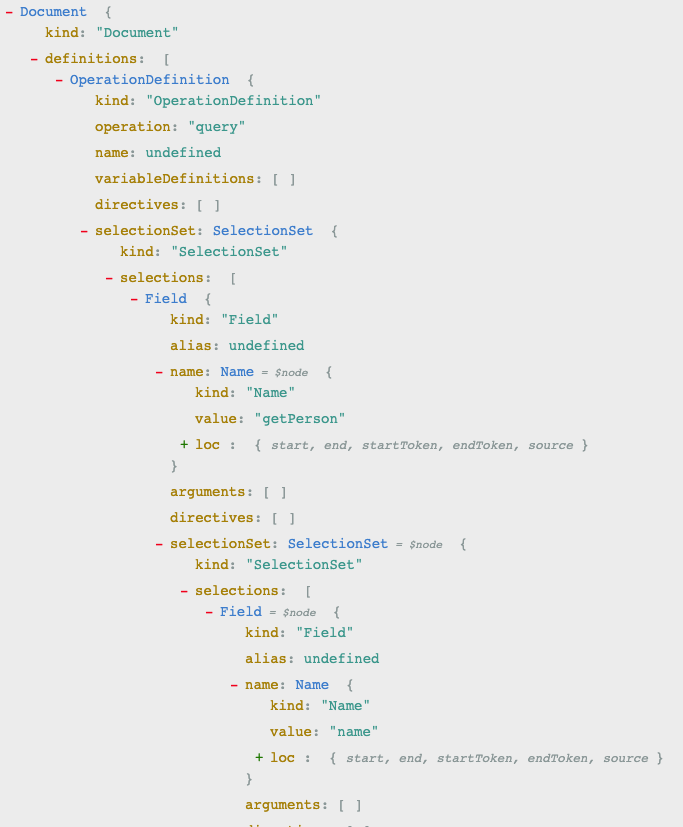
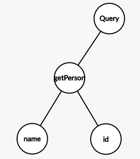

# [A walk in GraphQL](/README.md)

## Day 1: Queries and Resolvers

- Queries and Resolvers
  - Query
  - Resolver
  - Exercises
    - JavaScript
    - Python
    - Java
  - Learning resources

## Query

Before jumping to the code let's break down the "Query" concept into meaningful details.

What does **query** mean in GraphQL?

Generally speaking, **a "query"** is **not "a thing"** but **a process** that involves several building blocks in order to complete the operation:

### Definition of the documents

#### 1. The GraphQL document

One or more [GraphQL Documents](http://spec.graphql.org/June2018/#sec-Language.Document) containing **executable** or **representative** definitions of a GraphQL type system must be provided.

#### 2. The representative definition (schema)

On the **representative definition** there must be the ["Root Operation definition"](http://spec.graphql.org/June2018/#sec-Root-Operation-Types) related to the operation (will see this later) we want to perform, and the definition of the data type (whenever not included on the built-in [Scalar Types](http://spec.graphql.org/June2018/#sec-Scalars)) the operation is meant to return; in this case an [Object Type](http://spec.graphql.org/June2018/#sec-Objects).

```graphql
## an Object Type definition
type Person {
  id: ID ## a Scalar type definition for the `id` field
  name: String! ## a Scalar type definition for the `name` field
}

## A Root Operation definition
type Query {
  ## a Field describing a valid operation
  getPerson: Person!
}
```

#### 3. The executable definition (request)

On the **executable definition** there must be a valid [Operation Definition](http://spec.graphql.org/June2018/#sec-Language.Operations) specifying the `OperationType` (query, mutation, subscription) and a [SelectionSet](http://spec.graphql.org/June2018/#sec-Selection-Sets) describing the [Fields](http://spec.graphql.org/June2018/#sec-Language.Fields) describing data graph we want to receive.

```graphql
query { ## OperationType
  getPerson { ## parent SelectionSet Field
    name, ## child SelectionSet Field
    id ## parent SelectionSet Field
  }
}
```

A detailed description of the query operation definition is described at **[The Anatomy of a GraphQL Query](https://blog.apollographql.com/the-anatomy-of-a-graphql-query-6dffa9e9e747)** - by Sashko Stubailo

### Execution of a query operation

Now what?
It gets way more interesting!

Once you send the request to the server with the **query operation definition** (usually using the POST verb as GraphQL doesn't quite follow the HTTP protocol), your query will go through 3 phases during execution:

#### 1. Parsing the incoming request

Since the incoming request is just a string and GraphQL can't understand it as is, it has to **parse** it into an **AST** (Abstract Syntax Tree) **in order to perform** any necessary **validation** against the document before moving forward. (Read this interesting article [Understanding the GraphQL AST](https://medium.com/@adamhannigan81/understanding-the-graphql-ast-f7f7b8e62aa4) - by Adam Hannigan)

Here's an example of our query operation definition as an AST (a part of it as it's long):



Try it yourself here: [AST Explorer](https://astexplorer.net/#/gist/bc30ff1ae53ac33743c9a2786624719c/e6b95369aed2f6d0c083cbfe66dab08bfca3b035)

#### 2. Validation

Now is time to validate the produced AST:

> GraphQL does not just verify if a request is syntactically correct, but also ensures that it is unambiguous and mistake‐free in the context of a given GraphQL schema.
>
> An invalid request is still technically executable, and will always produce a stable result as defined by the algorithms in the [Execution](http://spec.graphql.org/June2018/#sec-Execution) section, however that result may be ambiguous, surprising, or unexpected relative to a request containing validation errors, so execution should only occur for valid requests.
>
> Typically validation is performed in the context of a request immediately before execution, however a GraphQL service may execute a request without explicitly validating it if that exact same request is known to have been validated before.
>
> Source: [GraphQL spec (June 2018) - Validation](http://spec.graphql.org/June2018/#sec-Validation)

The brilliant thing of the validation phase is that, as a developer, you have to do nothing about it!! The runtime will do that for you and in case of error it'll provide you a verbose error message so you can fix it.

What?!!! 🤔

-- will it check if a field is defined on the Query Type?
-- yes
-- will it check if the field accepts a given argument?
-- yes
-- will it check if the type of the argument is defined on the Query Type?
-- yes
-- will it recursively do those verification down to the last leaf?
-- yes
-- will it ...
-- enough
❤️

#### 3. Execution

Once validation is passed, the runtime will **transverse the AST invoking the resolver for each node of the graph and produce a result** (typically a JSON document reflecting the query operation hierarchical structure )

Let's see how that might look like:



- The **Root Query Operation Definition** node is the entry point for traversing the graph typically using a [BFS (Breadth-first search) algorithm](https://en.wikipedia.org/wiki/Breadth-first_search) for the execution, meaning getting deeper 1 level at a time.
- One level down there's the `getPerson` root field.
- **Before executing each Field**, the selection set is converted to a **grouped field set** by calling [CollectFields()](http://spec.graphql.org/June2018/#sec-Field-Collection). The [DFS (Depth‐First‐Search)](https://en.wikipedia.org/wiki/Depth-first_search) order of the field groups produced by CollectFields() is maintained through execution, **ensuring that fields appear in the executed response in a stable and predictable order, mirroring the shape of the requested query.**
- Once `getPerson`  is resolved it's the time to get 1 level down again, `name`and `id` cannot be executed until `getPerson`is done.
- Once all leaf-nodes resolve to a Scalar Type (or null), the execution is completed and the output is generated.

### A Query-driven schema approach

Of course you can design your schema mirroring your data storage structure, nothing stops you from doing that ... but ... what's the advantage on that?

The real power of your schema design relies on abstraction! You can create your Object Types based on the operations you need to execute, AND you can populate those object from any number of sources! You may have one field coming from a specific table of a MySQL database and another field coming from MongoDB and another coming from an XML-RPC or a third-party API!

Since the query hierarchical structure is self-descriptive:

1. Think about which data you're gonna need and which the relationships should look like.
2. Write a query
3. Define your Type system
4. Define your resolvers

See this [Example of a query-driven schema](https://www.apollographql.com/docs/apollo-server/schema/schema/#example-of-a-query-driven-schema).

That's a game changer, we now have.

1. An agnostic data storage layer that doesn't need to know or consider the client needs
2. An abstraction layer able to easily define a data shape contract independently from how and where the data is stored, and adaptable to the client's needs
3. A declarative client layer able to lead the way the data and operation's shapes should look like

Note the scale now is tilted to the client's need and not the other way around.

### The client's BIG BENEFITS

- **Self documented API:**
Your **schema** acts as an explicit contract which **determines**
  - **How** you can ask for data
  - **What** you're gonna get
  - **Shape** the response will look like
- Avoid client<->GraphQL over/under fetching by getting only what you asked for, not more nor less from GraphQL, **reducing significantly**:
  - **the traffic client<->GraphQL server**
  - **the number of operations** to handle the data required when you have more or less info than you need (e.g filtering, additional fetching)
  - **the response time**: client/server communication is a big bottle neck for your app, reducing the payload is a game changer (obviously if the bottle neck is from on your data layer under graphql, you'll need to work it out there)
  - **the app required memory**: again, you'll need to handle only the data you asked for.

### Breaking Changes

The schema **"contract"** is one of the most important, correction, we'd dare to say **IS THE MOST IMPORTANT** part of your GraphQL API, and keeping it consistent over time is critical.

> You can change the way you solve a problem, or break down a solution into many pieces, or optimize things, granted you won't introduce a breaking change on your schema.

If you do so, you're gonna be in big trouble (people's gonna hurt you) since everyone is expecting additive changes without mayor versioning changes of the API and ideally an ad-vitam backwards compatible API.

Here's a list of things on the DO-NOT-EVER-EVER-BY-ANY-MEANS-DO list:

- Remove or rename (which technically is a removal and an addition) a type or field
- Add, remove nullability to a field
- Remove a field's arguments

## Resolvers

We talked briefly about resolvers on our [Introduction](../../introduction/introduction.md#Resolvers) chapter, so let start breaking it down.

We said *"resolvers are **functions** containing arbitrary body code responsible for **returning** the related **Value** for a given **Field** in the **Executable Definition** of the **Schema**"* .... really (ಠ_ಠ)? Thanks for nothing (◔_◔).

Ok, that was kinda hermetic. Let's break it down starting with our **Type Definition** in our **representative definition**:

```graphql
## an Object Type definition
type Person {
  id: ID
  name: String!
  surname: String!
  fullName: String!
  age: Int
  friend: Person
}
```

Now we need our "entry point", the **Root Operation definition** with a field describing our API also in our **representative definition**:

```graphql
## A Root Operation definition
type Query {
  ## a Field describing a valid operation
  getPerson: Person!
}
```

And now, on the **executable definition** we make a request by sending a **GraphQL query operation**.

```graphql
query { ## OperationType
  getPerson { ## parent SelectionSet Field
    name ## child SelectionSet Field
    age ## child SelectionSet Field, sibling to name
  }
}
```

We won't go again through the "execution phase" we already saw on the Query section. Instead we'll go deeper on the "how" it's executed.

### Resolver function signature

**Let's make a stop on the "function containing arbitrary body code" thing.**  
Why not just "containing arbitrary code"?
What's that "body" word telling us?

Depending on the language it might be explicit, or implicit, but **every resolver function in GraphQL will accept 4 positional arguments** (that's not on the body and it's not arbitrary)

```javascript

/**
 * JavaScript example
 *
 * @param {Object} parent The result returned by the parent field resolver (also found as root, obj, ...)
 * @param {Object} args The object containing the arguments passed into the field in the query.
 * @param {Object} context An arbitrary object shared across the resolver chain in a particular query.
 * @param {Object} info An object containing the execution state of the query. The generated AST!
 *
 * @returns {Null|Undefined|Array|Promise|Object|Scalar}
 */
function myResolver (obj, args, context, info){
  // here your arbitrary code
}

```

In case you didn't specify a resolver for a type, GraphQL will fallback to a **Default Resolver** which will:

1. Returns a property from `parent` with the same field name, or
2. Calls a function on `parent` with the same field name and passes the query arguments along to that function.

For more detailed descriptions:

- [Resolver function signature](https://www.apollographql.com/docs/graphql-tools/resolvers/#resolver-function-signature)
- [Resolver result format](https://www.apollographql.com/docs/graphql-tools/resolvers/#resolver-result-format)

### Resolver Chain

Now another concept arises: **Resolver Chain**. To understand that let's go back to the **"It's Graphs All the Way Down"** and traverse our executable definition invoking resolvers (it's an intentional shallow example, for a deeply nested one take a loo [here](https://www.apollographql.com/docs/apollo-server/data/resolvers/#resolver-chains))

The hierarchical structure of the query will be replicated and the sibling resolvers will be invoked in parallel.

```graph
Query.getPerson()+---> Person.name()
                  \
                   +-> Person.age()
```

Here's how our code might look like:

```javascript
const resolverMap = {
  Query: {
    getPerson(parent, args, context, info) {
      return {
        id: '1',
        name: 'Darth',
        surname: 'Vader',
      };
    },
  }
};
```

Output:

```json
{
  "data": {
    "getPerson": {
      "name": "Darth",
      "age": null
    }
  }
}
```

At this point you might have noticed some weird things.

1. `getPerson` is returning a partial shape
2. There's no resolver for `Person` or for its fields.
3. Some information (`age`) I asked for is not present on the resolver's returned data, but is present on the output
4. All above just happened without errors

What happened here?

### Default Resolver

Most of GraphQl server implementations will provide a **Default Resolver** to fallback whenever an explicit resolver hasn't been provided.

Here's a sample code from [graphql-js](https://github.com/graphql/graphql-js/blob/master/src/execution/execute.js#L1181-L1199) repository

```javascript
/**
 * If a resolve function is not given, then a default resolve behavior is used
 * which takes the property of the source object of the same name as the field
 * and returns it as the result, or if it's a function, returns the result
 * of calling that function while passing along args and context value.
 */
export const defaultFieldResolver: GraphQLFieldResolver<
  mixed,
  mixed,
> = function(source: any, args, contextValue, info) {
  // ensure source is a value for which property access is acceptable.
  if (isObjectLike(source) || typeof source === 'function') {
    const property = source[info.fieldName];
    if (typeof property === 'function') {
      return source[info.fieldName](args, contextValue, info);
    }
    return property;
  }
};
```

and here a human readable explanation from [Apollo team's Default resolvers documentation](https://www.apollographql.com/docs/apollo-server/data/resolvers/#default-resolvers)

If you were really attentive there's another interesting thing happening there:

`age` is defined as a `nullable` property in our schema, so defaulting to `null` when the property is missing makes total sense, on the other hand, `fullName` is defined as `non-nullable`! why it didn't throw an error?

Because a resolver will ONLY be invoked when the information is required for the output, since it's not directly or indirectly (relationship) involved on the requested query, it won't be executed, therefore it won't fail.

Let's make it fail!

Query

```graphql
query {
  getPerson {
    fullName
    age
  }
}
```

Response

```json
{
  "errors": [
    {
      "message": "Cannot return null for non-nullable field Person.fullName.",
      "locations": [
        {
          "line": /* the line number */,
          "column": /*the column number */
        }
      ],
      "path": [
        "getPerson",
        "fullName"
      ],
      "extensions": {
        "code": "INTERNAL_SERVER_ERROR",
        "exception": {
          "stacktrace": [/* bunch of staff here */]
        }
      }
    }
  ],
  "data": null
}
```

💥 BOOM! How can we solve that?

### Field-level resolver

We saw what a **top-level resolver** is, now let's add a **field-level resolver** to our resolver map.

```javascript
const resolverMap = {
    Query: {
      getPerson(parent, args, context, info) {
        return {
          id: '1',
          name: 'Darth',
          surname: 'Vader',
        };
      },
    },
    Person: {
      fullName(parent, args, context, info) {
        return `${parent.name} ${parent.surname}`;
      }
    }
  };
```

```json
{
  "data": {
    "getPerson": {
      "fullName": "Darth Vader",
      "age": null
    }
  }
}
```

WOW! The top-level resolver `getPerson` passed along the `Person` object containing `name` and `surname` properties down to the next chain link and therefore is available on the first argument of the `fullName` **field-resolver** which returns a scalar value; and `age` field is still falling back to the **default resolver**. ヽ( •_)ᕗ

### Asynchronous resolvers

In a real world application you'll deal with one or more different sources for your data which will require asynchronous actions to return the data. One of the possible values a resolver can return is a `Promise`.

Here a trivial example in JavaScript

```javascript
const resolverMap = {
    Query: {
      getPerson(parent, args, context, info) {
        return new Promise((resolve, reject) => {
          setTimeout(() => {
            resolve({
              id: '1',
              name: 'Darth',
              surname: 'Vader',
            });
          }, 5000)
        });
      },
    },
    Person: {
      fullName(parent, args, context, info) {
        return `${parent.name} ${parent.surname}`;
      }
    }
  };
```

The top-level resolver will return a `Promise`, after 5 seconds it'll resolve to the `Person` value as the first argument for the `fullName` field-level to be executed.

------------

**IMPORTANT NOTE:**

The execution flow is [non-deterministic](https://en.wikipedia.org/wiki/Nondeterministic_algorithm) because

- Even though **BFS** is a well known algorithm, the **execution order** for each sibling node is **NOT GUARANTEED**, it' will depend on the runtime implementation.
- Since resolvers can be asynchronous, the **resolution order** for each sibling node or an entire branch is **NOT GUARANTEED**

So, **defining** your **resolvers** as **atomic** and **pure functions** is critical. Meaning **DON'T mutate the context object** on your resolvers, ever, or you'll get badly hurt rather sooner than later.
